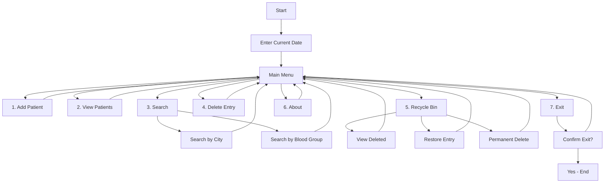

<div align="center">

# 🏥 Hospital Management System


[](https://isocpp.org/)
[](https://github.com)
[](LICENSE)
[](https://github.com)

**A comprehensive console-based hospital management system built with modern C++**

[Features](#-features) • [Installation](#-installation) • [Usage](#-usage) • [Documentation](#-documentation) • [Contributing](#-contributing)

</div>

---

## 📋 Table of Contents

- [Overview](#-overview)
- [Features](#-features)
- [System Architecture](#-system-architecture)
- [Technologies Used](#-technologies-used)
- [Installation](#-installation)
- [Compilation](#-compilation)
- [Usage](#-usage)
- [Project Structure](#-project-structure)
- [Data Models](#-data-models)
- [Menu System](#-menu-system)
- [Screenshots](#-screenshots)
- [Troubleshooting](#-troubleshooting)
- [Future Enhancements](#-future-enhancements)
- [Contributing](#-contributing)
- [License](#-license)
- [Contact](#-contact)

---

## 🌟 Overview

The **Hospital Management System** is a robust, console-based application designed to streamline hospital operations and patient data management. Built with modern C++ standards, this system provides healthcare professionals with an intuitive interface to manage patient records, search functionality, and data recovery options.

<div align="center">

### 🎯 Key Highlights

| Feature | Description |
|---------|-------------|
| 🔐 **Secure** | Safe patient data handling |
| ⚡ **Fast** | Optimized C++ performance |
| 📊 **Organized** | Structured data management |
| 🔍 **Searchable** | Advanced search capabilities |
| ♻️ **Recoverable** | Recycle bin functionality |

</div>

---

## ✨ Features

### 🏥 **Patient Management**
- ✅ Register new patient information
- ✅ Store comprehensive patient details including:
  - Personal information (Name, Age, Gender)
  - Contact details (Address with city, district, state, country)
  - Medical information (Blood group, Marital status)
  - Registration number assignment
- ✅ Validate and verify data input
- ✅ Prevent duplicate entries

### 🔍 **Advanced Search System**
- 🌆 **Search by City**: Find all patients from a specific city
- 🩸 **Search by Blood Group**: Locate patients by blood type
  - A+ / A- / B+ / B- / O+ / O- / AB+ / AB-
- 📑 **Multiple result handling**: View all matching records
- 🎯 **Real-time search**: Instant results display

### 👁️ **Patient Details Viewing**
- 📋 View complete patient information
- 📊 Display all registered patients
- 🔢 Show registration numbers
- 📱 Formatted output for readability

### 🗑️ **Delete Operations**
- ❌ Delete individual patient records
- 🎫 Delete by registration number
- ⚠️ Confirmation prompts for safety
- 📁 Automatic recycle bin storage

### ♻️ **Recycle Bin System**
- 🗄️ Temporarily store deleted records
- 🔄 Restore deleted entries
- 🧹 Permanently delete records
- 📊 View all deleted items
- 🔐 Data recovery protection

### ℹ️ **System Information**
- 📖 Software details and credits
- 👨‍💻 Developer information
- 📧 Contact information
- 🎨 About section

### 🚪 **Exit & Navigation**
- ✅ Safe exit with confirmation
- 🔙 Back navigation options
- 🔄 Menu navigation flow
- ⚡ Quick access shortcuts

---

## 🏗️ System Architecture

```
┌─────────────────────────────────────────────┐
│         Hospital Management System          │
└─────────────────────────────────────────────┘
                      │
        ┌─────────────┼─────────────┐
        │             │             │
   ┌────▼────┐   ┌───▼────┐   ┌───▼────┐
   │  Data   │   │ Search │   │ Delete │
   │ Layer   │   │ Engine │   │ Manager│
   └────┬────┘   └───┬────┘   └───┬────┘
        │            │            │
   ┌────▼────────────▼────────────▼────┐
   │       Patient Records Store       │
   │  (Array-based Storage - 100 max)  │
   └───────────────────────────────────┘
```

### 🎨 Class Structure

```cpp
┌──────────────────────────────────────────┐
│            Class Hierarchy               │
├──────────────────────────────────────────┤
│                                          │
│  📦 Class: all                           │
│  ├── Patient Management                  │
│  ├── Search Operations                   │
│  ├── Delete & Restore                    │
│  └── Menu System                         │
│                                          │
│  📦 Class: date                          │
│  ├── Current date management             │
│  └── Date display functions              │
│                                          │
│  📦 Class: dob                           │
│  ├── Date of birth handling              │
│  └── Age calculations                    │
│                                          │
│  📦 Class: temp                          │
│  ├── Temporary variables                 │
│  ├── Index management                    │
│  └── Counters & flags                    │
│                                          │
└──────────────────────────────────────────┘
```

---

## 🛠️ Technologies Used

<div align="center">

| Technology | Version | Purpose |
|------------|---------|---------|
|  | C++11+ | Core Programming Language |
|  | 6.3.0+ | Compiler |
|  | Latest | Windows Compilation |
|  | - | Data Structures |

</div>

### 📚 Libraries & Headers
```cpp
#include<iostream>     // Input/Output operations
#include<cstdlib>      // System commands, exit()
#include<cstring>      // String operations
#include<conio.h>      // Console I/O (getch())
```

---

## 📥 Installation

### Prerequisites

Before you begin, ensure you have the following installed:

<details>
<summary>🪟 <b>Windows</b></summary>

```bash
# Install MinGW GCC Compiler
# Download from: https://sourceforge.net/projects/mingw/

# Or use Chocolatey
choco install mingw

# Verify installation
g++ --version
```
</details>

<details>
<summary>🐧 <b>Linux</b></summary>

```bash
# Ubuntu/Debian
sudo apt update
sudo apt install g++ build-essential

# Fedora
sudo dnf install gcc-c++

# Arch Linux
sudo pacman -S gcc

# Verify installation
g++ --version
```
</details>

<details>
<summary>🍎 <b>macOS</b></summary>

```bash
# Install Xcode Command Line Tools
xcode-select --install

# Or use Homebrew
brew install gcc

# Verify installation
g++ --version
```
</details>

### 📦 Clone Repository

```bash
# Clone the repository
git clone https://github.com/yourusername/hospital-management-system.git

# Navigate to project directory
cd hospital-management-system

# Navigate to source code
cd "Source code"
```

---

## 🔨 Compilation

### Quick Compile

```bash
# Basic compilation
g++ Project.cpp -o HospitalMS.exe

# With optimizations
g++ -O2 Project.cpp -o HospitalMS.exe

# With debugging symbols
g++ -g Project.cpp -o HospitalMS.exe

# With warnings enabled
g++ -Wall -Wextra Project.cpp -o HospitalMS.exe
```

### Advanced Compilation Options

```bash
# Full optimization with C++11 standard
g++ -std=c++11 -O3 -Wall -Wextra Project.cpp -o HospitalMS.exe

# Debug build with sanitizers
g++ -std=c++11 -g -fsanitize=address -fsanitize=undefined Project.cpp -o HospitalMS.exe

# Static linking (portable executable)
g++ -static Project.cpp -o HospitalMS.exe
```

### 🎯 Build Output

After successful compilation:
```
✓ Compilation successful!
✓ Executable created: HospitalMS.exe
✓ Size: ~118KB
✓ Ready to run!
```

---

## 🚀 Usage

### Running the Application

```bash
# Windows
./HospitalMS.exe

# or simply
HospitalMS

# Linux/macOS
./HospitalMS
```

### 📖 Step-by-Step Guide

#### 1️⃣ **Initial Setup**
```
Welcome to...

***HOSPITAL MANAGEMENT SOFTWARE***
       By Iftikhar Malik       

First of all I need the current date...
Year  : 2026
Month : 2
Date  : 27
```

#### 2️⃣ **Main Menu**
```
***Hospital Management Tasks***
*******************************

Please select a task to do....

1. Enter a new patient information
2. View detail of existing patient
3. Search by city or blood group
4. Delete entry
5. Recycle Bin
6. About
7. Exit
```

#### 3️⃣ **Adding a Patient**
```
Enter patient information:
- Name
- House Number
- Street
- City
- District
- State
- Country
- Sex (Male/Female)
- Date of Birth
- Blood Group
- Marital Status
```

#### 4️⃣ **Searching Patients**
```
Search Menu:
1. Search by City
2. Search by Blood Group
3. Back to main menu
```

#### 5️⃣ **Managing Records**
```
- View all patients
- Delete specific entry
- Use recycle bin
- Restore deleted records
```

---

## 📁 Project Structure

```
Hospital Management System/
│
├── 📄 README.md                    # This file
├── 📄 LICENSE                      # License information
│
└── 📂 Source code/
    ├── 📄 Project.cpp              # Main source code (2244 lines)
    ├── 📄 Project.txt              # Backup source
    └── 💾 HospitalMS.exe           # Compiled executable
```

### 📊 Code Statistics

```
Total Lines:        2,244 lines
Classes:            4 (all, date, dob, temp)
Functions:          30+
Data Structures:    Nested structures for patients
Max Capacity:       100 patients
```

---

## 🗂️ Data Models

### 👤 Patient Information Structure

```cpp
struct patient_info {
    // Personal Information
    char name[50];              // Patient name
    int reg_no;                 // Registration number
    int sex;                    // Gender (1=Male, 2=Female)
    int martial_status;         // Marital status
    
    // Medical Information
    int bld_group;              // Blood group (1-8)
    
    // Date of Birth
    age A1 {
        int day;
        int month;
        int year;
    };
    
    // Address Information
    address AD1 {
        int house;              // House number
        char street[30];        // Street name
        char city[30];          // City
        char dist[30];          // District
        char state[30];         // State
        char country[30];       // Country
    };
};
```

### 🩸 Blood Group Codes

| Code | Blood Type | Code | Blood Type |
|------|------------|------|------------|
| 1    | A+         | 5    | B+         |
| 2    | A-         | 6    | B-         |
| 3    | AB+        | 7    | O+         |
| 4    | AB-        | 8    | O-         |

---

## 🎮 Menu System

<div align="center">



</div>

---

## 📸 Screenshots

### 🏠 Main Menu
```
╔════════════════════════════════════════════╗
║                                            ║
║  ***HOSPITAL MANAGEMENT SOFTWARE***        ║
║         By Iftikhar Malik                  ║
║                                            ║
║  ***Hospital Management Tasks***           ║
║  *******************************           ║
║                                            ║
║  Please select a task to do....           ║
║                                            ║
║  1. Enter a new patient information        ║
║  2. View detail of existing patient        ║
║  3. Search by city or blood group          ║
║  4. Delete entry                           ║
║  5. Recycle Bin                            ║
║  6. About                                  ║
║  7. Exit                                   ║
║                                            ║
╚════════════════════════════════════════════╝
```

### 📝 Patient Entry Form
```
╔════════════════════════════════════════════╗
║    PATIENT INFORMATION ENTRY FORM          ║
╠════════════════════════════════════════════╣
║                                            ║
║  Name              : John Doe              ║
║  House No.         : 123                   ║
║  Street            : Main Street           ║
║  City              : New York              ║
║  District          : Manhattan             ║
║  State             : NY                    ║
║  Country           : USA                   ║
║  Sex               : Male                  ║
║  Date of Birth     : 15/01/1990            ║
║  Blood Group       : O+                    ║
║  Marital Status    : Married               ║
║                                            ║
╚════════════════════════════════════════════╝
```

---

## 🔧 Troubleshooting

<details>
<summary><b>❌ Compilation Errors</b></summary>

**Problem**: `conio.h: No such file or directory`

**Solution**:
- On Linux/macOS, `conio.h` is not available by default
- Comment out `#include<conio.h>` and replace `getch()` with `cin.get()`
- Or use alternative: `#include <ncurses.h>`

```cpp
// Replace
#include<conio.h>
getch();

// With
#include<iostream>
cin.get();
```
</details>

<details>
<summary><b>❌ system("cls") Not Working</b></summary>

**Problem**: Screen doesn't clear on Linux/macOS

**Solution**:
```cpp
// Replace
system("cls");

// With (cross-platform)
#ifdef _WIN32
    system("cls");
#else
    system("clear");
#endif
```
</details>

<details>
<summary><b>⚠️ Data Not Persisting</b></summary>

**Problem**: Data disappears after closing program

**Solution**: This version stores data in memory only. For persistent storage:
- Add file I/O operations
- Save data to text/binary files
- Implement database integration
</details>

<details>
<summary><b>🐛 Runtime Errors</b></summary>

**Problem**: Segmentation fault or crash

**Solution**:
1. Check array bounds (max 100 patients)
2. Validate user input
3. Compile with debug flags: `g++ -g Project.cpp`
4. Run with debugger: `gdb ./HospitalMS`
</details>

---

## 🚀 Future Enhancements

### 🎯 Planned Features

- [ ] 💾 **Database Integration**
  - [ ] SQLite support
  - [ ] MySQL/PostgreSQL connectivity
  - [ ] Data persistence

- [ ] 🖥️ **GUI Implementation**
  - [ ] Qt framework
  - [ ] WxWidgets interface
  - [ ] Modern UI/UX design

- [ ] 📊 **Advanced Features**
  - [ ] Appointment scheduling
  - [ ] Medical history tracking
  - [ ] Prescription management
  - [ ] Billing system
  - [ ] Report generation

- [ ] 🔐 **Security**
  - [ ] User authentication
  - [ ] Role-based access
  - [ ] Data encryption
  - [ ] Audit logs

- [ ] 📱 **Export Options**
  - [ ] PDF generation
  - [ ] Excel export
  - [ ] CSV format
  - [ ] Print functionality

- [ ] 🌐 **Network Features**
  - [ ] Multi-user support
  - [ ] Client-server architecture
  - [ ] Cloud backup
  - [ ] Remote access

- [ ] 🧪 **Testing**
  - [ ] Unit tests
  - [ ] Integration tests
  - [ ] Performance benchmarks

---

## 🤝 Contributing

Contributions are what make the open source community amazing! Any contributions you make are **greatly appreciated**.

### How to Contribute

1. 🍴 **Fork the Project**
   ```bash
   git clone https://github.com/yourusername/hospital-management-system.git
   ```

2. 🌿 **Create your Feature Branch**
   ```bash
   git checkout -b feature/AmazingFeature
   ```

3. ✍️ **Commit your Changes**
   ```bash
   git commit -m 'Add some AmazingFeature'
   ```

4. 📤 **Push to the Branch**
   ```bash
   git push origin feature/AmazingFeature
   ```

5. 🎉 **Open a Pull Request**

### 📋 Contribution Guidelines

- Follow C++ best practices
- Add comments for complex logic
- Update documentation
- Test your changes thoroughly
- Follow existing code style

---

## 📄 License

Distributed under the MIT License. See `LICENSE` file for more information.

```
MIT License

Copyright (c) 2026 Hospital Management System

Permission is hereby granted, free of charge, to any person obtaining a copy
of this software and associated documentation files (the "Software"), to deal
in the Software without restriction, including without limitation the rights
to use, copy, modify, merge, publish, distribute, sublicense, and/or sell
copies of the Software, and to permit persons to whom the Software is
furnished to do so, subject to the following conditions:

The above copyright notice and this permission notice shall be included in all
copies or substantial portions of the Software.
```

---

## 👨‍💻 Developer Information

<div align="center">

### 💼 Original Developer: Iftikhar Malik

### 🔧 Maintained & Updated By: [Your Name]

[](https://github.com/yourusername)
[](https://linkedin.com/in/yourusername)
[](mailto:your.email@example.com)

</div>

---

## 📞 Contact

For questions, suggestions, or issues:

- 📧 **Email**: mustafizur_04@sify.com
- 🐛 **Issues**: [GitHub Issues](https://github.com/yourusername/hospital-management-system/issues)
- 💬 **Discussions**: [GitHub Discussions](https://github.com/yourusername/hospital-management-system/discussions)

---

## 📚 Documentation

### Additional Resources

- 📖 [User Manual](docs/USER_MANUAL.md)
- 🛠️ [Developer Guide](docs/DEVELOPER_GUIDE.md)
- 🎨 [Code Style Guide](docs/STYLE_GUIDE.md)
- 🔄 [Changelog](CHANGELOG.md)

---

## ⭐ Acknowledgments

- Original concept and development by **Iftikhar Malik**
- Inspired by real-world hospital management needs
- Built with ❤️ for healthcare professionals
- Thanks to all contributors and users

---

## 📊 Project Stats

<div align="center">


</div>

---

<div align="center">

### 🌟 Star this repository if you find it helpful! 🌟

**Made with ❤️ using C++**


### 📜 [View on GitHub](https://github.com/yourusername/hospital-management-system)

---

**© 2026 Hospital Management System. All Rights Reserved.**


</div>
